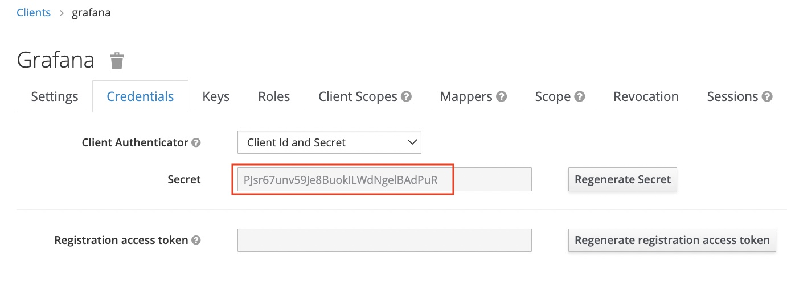

# Setup
### Create network keycloak_net:
```
docker network create keycloak_net
```
### Spin up containers:
```bash
docker-compose up -d keycloak
```
### Go to [https//localhost:8443](https//localhost:8443)
# Configure Keycloak
- ## Create realm *demo*
- ## Create user
- ## Create client grafana:

- ## Copy secret to grafana config file:



- ## Create Roles:


- ## Create group(s) & Group mappings:


- ## repeat for grafana_editor:
- ## Add User to group
- ## Create Client mappings:


# Start grafana
```
docker-compose up -d
```
```
docker-compose ps
```
## Go to [https//localhost:8443](http//localhost:4000)

# Video

# References
## Check Realm Endpoints:
```
{{server}}/auth/realms/{{realm}}/.well-known/openid-configuration
```
```
https://localhost:8443/realms/demo/.well-known/openid-configuration
```

